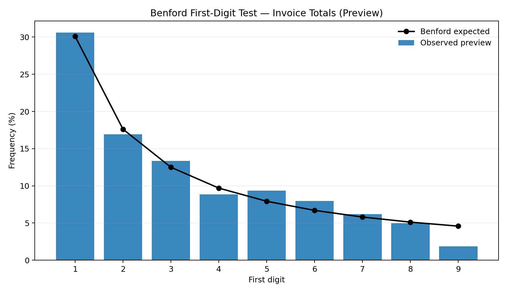
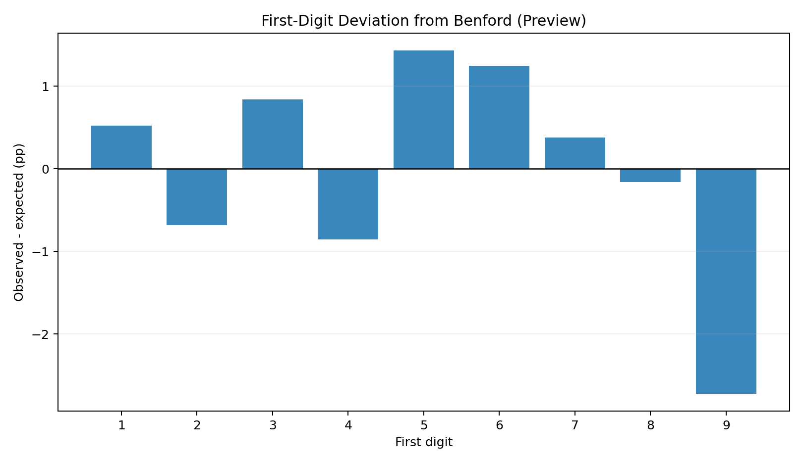
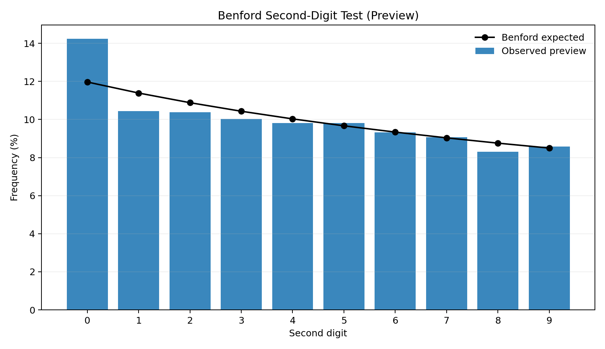
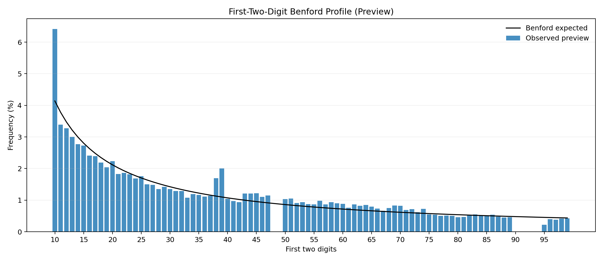
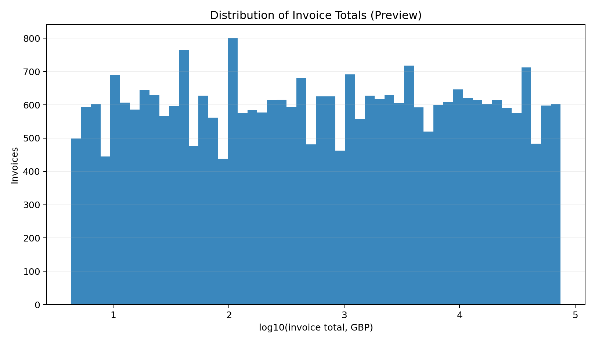
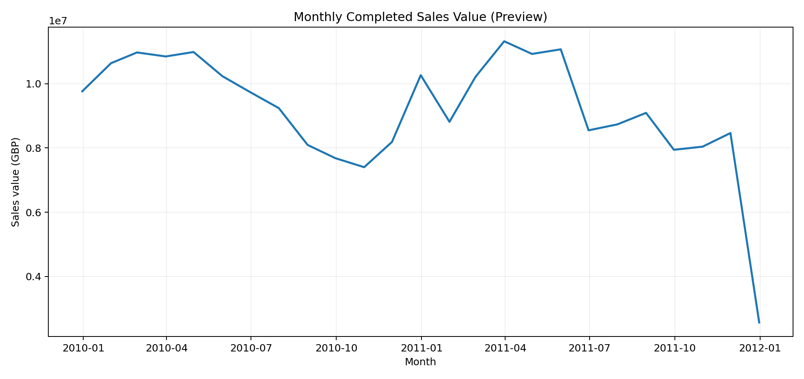
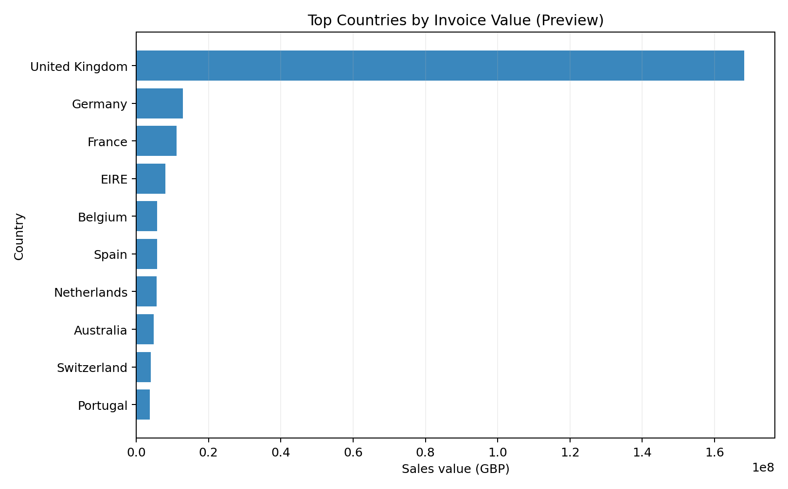
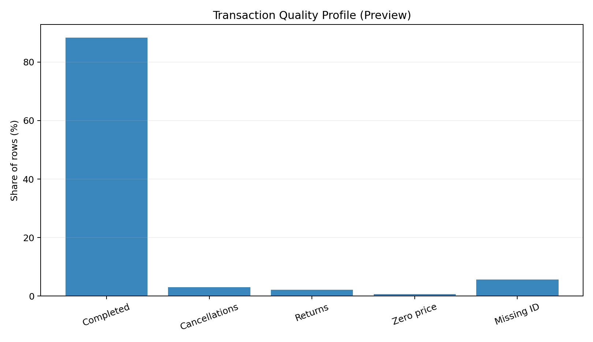
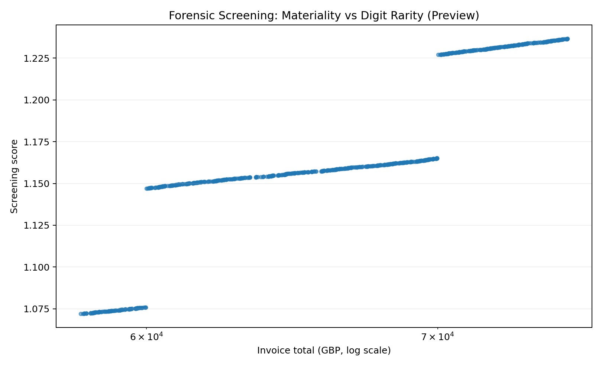

# Data Science Portfolio — Forensic Sales Analytics with Benford's Law

A forensic data science investigation of **retail sales transactions** using Benford's Law, formal goodness-of-fit testing, anomaly screening, SQL, reusable Python OOP, pandas, NumPy, SciPy and Matplotlib.

The repository keeps the original portfolio-style top-level arrangement:

| Section | Purpose |
|---|---|
| `PythonOOP` | Reusable Benford/statistical testing engine |
| `PythonWebScraping` | UCI retail data acquisition, cleaning, forensic analysis, tables, notebook and visualizations |
| `SQL` | SQL implementation of cleaning, invoice aggregation and Benford diagnostics |
| `.gitignore` | Keeps large raw files/local artifacts out while retaining the visualization gallery |
| `README.md` | Project overview |

## Visual forensic analysis

The project is intentionally visual. The charts below are **committed preview graphics** so a reviewer sees the analytical design immediately on GitHub. They are generated from a deterministic synthetic retail preview population and are clearly marked *Preview*. Running `retail_benford_analysis.py` on the official UCI Online Retail II data regenerates the production figures from real transactions in `outputs/figures/`.

| Benford first digit | Deviation from expectation |
|---|---|
|  |  |

| Second digit | First two digits |
|---|---|
|  |  |

| Invoice-value distribution | Monthly sales trend |
|---|---|
|  |  |

| Country sales profile | Data-quality profile |
|---|---|
|  |  |

### Forensic screening



All analytical figures use the standard **Matplotlib/Python blue `#1f77b4`** for observed data and black for theoretical Benford expectations.

## Dataset

The production analysis uses **UCI Online Retail II**, a real two-year transaction log with **1,067,371 records** from a UK-based non-store retailer. It contains invoice number, stock code, description, quantity, invoice date, unit price, customer ID and country.

- Dataset: UCI Online Retail II
- DOI: `10.24432/C5CG6D`
- Period: 1 December 2009 to 9 December 2011
- License: CC BY 4.0
- Primary forensic population: **completed positive-value invoice totals**
- Secondary population: positive sales-line amounts

The raw workbook is intentionally not committed because of its size. From `PythonWebScraping/`:

```bash
python download_data.py
python retail_benford_analysis.py
```

## Scientific tests

The forensic pipeline includes first-digit, second-digit and first-two-digit Benford tests; Pearson chi-square goodness-of-fit; Monte Carlo goodness-of-fit; Mean Absolute Deviation (MAD); KS-style cumulative-distance diagnostics; digit-level z-tests with Benjamini-Hochberg FDR correction; applicability checks; and invoice-level anomaly screening combining digital rarity and monetary materiality.

## Interpretation rule

Benford nonconformity is **not evidence of fraud by itself**. Pricing rules, promotions, product mix, thresholds, refunds, cancellations and aggregation structure can all produce legitimate deviations. The project therefore separates data-quality controls, statistical evidence and investigative screening.
